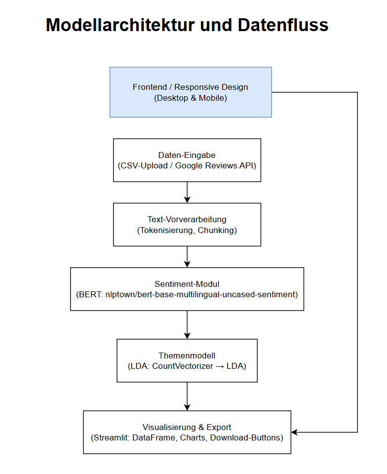

# Feedback-AI: KI-basierte Kundenfeedback-Analyse für KMU

## Projektübersicht

Feedback-AI ist eine benutzerfreundliche Webanwendung, die kleinen und mittleren Unternehmen (KMU) ermöglicht, Kundenfeedback automatisch zu analysieren und zu visualisieren. Die Anwendung nutzt moderne KI-Technologien, um Stimmungen (Sentiment) in Texten zu erkennen und häufige Themen zu identifizieren, ohne dass eigene Data-Science-Ressourcen benötigt werden.

## Funktionen

- **Sentiment-Analyse**: Automatische Erkennung der Stimmung in Kundenfeedback (1–5 Sterne).
- **Themenmodellierung**: Identifikation häufiger Themen in Kundenfeedback.
- **Batch-Verarbeitung**: Analyse großer Mengen von Feedback-Daten über CSV-Upload.
- **Einzelanalyse**: Direkte Eingabe und Analyse einzelner Feedback-Texte.
- **Datenvisualisierung**: Übersichtliche Darstellung der Analyseergebnisse.
- **Export-Funktion**: Speichern der Ergebnisse als CSV-Datei.

## Technologie-Stack

- **Programmiersprache**: Python 3.11
- **Frameworks**:
  - Hugging Face Transformers (BERT-Modell für Sentiment-Analyse)
  - scikit-learn (für Themenmodellierung mit LDA)
- **Frontend**: Streamlit
- **Datenvisualisierung**: seaborn, plotly
- **Datenquellen**: Google Reviews API, CSV-Dateien, Umfragen

## Projektstruktur

```
feedback-ai/
├── data/                  → Beispieldaten
│   ├── google_reviews.csv → Google Reviews Beispieldaten
│   └── customer_reviews.csv → Synthetische Kundenfeedback-Daten
├── notebooks/             → Jupyter Notebooks für Exploration & Modelltraining
│   ├── data_inventory.xlsx → Übersicht aller Datenquellen
│   ├── sentiment_analysis_exploration.ipynb → Exploration der Sentiment-Analyse
│   └── topic_modeling_exploration.ipynb → Exploration der Themenmodellierung
├── model/                 → Trainierte Modelle und Konfiguration
│   ├── __init__.py
│   ├── config.py          → Modellkonfigurationen
│   ├── sentiment.py       → Sentiment-Analyse-Implementierung
│   └── topics.py          → Themenmodellierungs-Implementierung
├── app/                   → Streamlit Web-App
│   └── main.py            → Hauptanwendung
├── static/                → Bilder, Style-Guidelines
│   ├── logo.png           → Anwendungslogo
│   ├── style.css          → CSS-Stile für die Anwendung
│   └── style_guidelines.md → Design-Richtlinien
├── docs/                  → Screenshots & Responsive-Tests
│   ├── Desktop1.png       → Screenshot Desktop-Layout
│   ├── Desktop2.png       → Screenshot Desktop-Layout (Themen)
│   └── responsive_tests.md → Dokumentation der Responsive-Tests
├── .gitignore             → Ignorierliste für Git
├── Modellarchitektur.png  → Grafische Wireframe-Skizze aller Komponenten + Datenfluss
├── README.md              → Projektbeschreibung (diese Datei)
├── app_user_guide.md      → Benutzerhandbuch für die Web-App
└── requirements.txt       → Abhängigkeiten
```

## Modellarchitektur und Datenfluss

Unten sehen Sie die grafische Übersicht über die Hauptkomponenten und den Datenfluss unserer KI-Anwendung.  
Das Responsive Design (Desktop & Mobile) beeinflusst dabei ausschließlich die Darstellung des letzten Blocks (Visualisierung & Export).

**Frontend / Responsive Design (Desktop & Mobile)**  
Dieser Block steht oberhalb der Pipeline und zeigt, dass sich die Darstellung der Analyseergebnisse je nach Endgerät unterscheidet. Der Pfeil führt direkt zum letzten Block.

**Daten-Eingabe**  
CSV-Upload oder Google Reviews API – das Feedback gelangt von hier in den Verarbeitungspfad.

**Text-Vorverarbeitung (Tokenisierung, Chunking)**  
Texte werden in Tokens zerlegt. Bei langen Texten erfolgt Chunking, um die 512-Token-Grenze des Modells einzuhalten.

**Sentiment-Modul (BERT: nlptown/bert-base-multilingual-uncased-sentiment)**  
Das Modell gibt eine Sternebewertung (1–5) zurück. Die Bewertung wird in Labels (positiv, neutral, negativ) überführt.

**Themenmodell (LDA: CountVectorizer → LDA)**  
Mittels CountVectorizer wird eine Dokument-Term-Matrix erstellt. LDA extrahiert auf dieser Basis Themen mit den häufigsten Schlüsselbegriffen.

**Visualisierung & Export (Streamlit: DataFrame, Charts, Download-Buttons)**  
Die Ergebnisse werden in einer interaktiven Oberfläche dargestellt. Export als CSV ist jederzeit möglich.



## Installation

1. **Repository klonen**  
```bash
git clone https://github.com/VladiC0de/feedback-ai.git
cd feedback-ai
```

2. **Virtuelle Umgebung erstellen und Abhängigkeiten installieren**  
```bash
python -m venv venv
# Unter Windows:
venv\Scripts\activate
# Unter macOS/Linux:
source venv/bin/activate
pip install -r requirements.txt
```

3. **Anwendung starten**  
```bash
cd app
streamlit run main.py
```

## Nutzung

Die Anwendung bietet zwei Hauptfunktionen:

### 1. Batch-Analyse von CSV-Dateien

- Laden Sie eine CSV-Datei mit einer `text`-Spalte hoch  
- Klicken Sie auf "Batch-Sentiment analysieren"  
- Die Ergebnisse werden in einer Tabelle angezeigt  
- Optional können Sie Themen extrahieren lassen  
- Exportieren Sie die Ergebnisse als CSV-Datei  

### 2. Manuelle Einzel-Analyse

- Geben Sie einen Text in das Textfeld ein  
- Klicken Sie auf "Einzel-Sentiment analysieren"  
- Das Ergebnis wird sofort angezeigt  

Eine detaillierte Bedienungsanleitung finden Sie in der [Dokumentation](app_user_guide.md).

## Modelle

### Sentiment-Analyse

Für die Sentiment-Analyse wird das vortrainierte BERT-Modell `nlptown/bert-base-multilingual-uncased-sentiment` verwendet, das Texte auf einer Skala von 1–5 Sternen bewertet. Für lange Texte wird eine Chunking-Strategie implementiert.

### Themenmodellierung

Die Themenmodellierung verwendet Latent Dirichlet Allocation (LDA) aus scikit-learn, um häufige Themen in den Texten zu identifizieren. Die optimale Anzahl von Themen kann vom Benutzer festgelegt werden.

## Datenquellen

Die Anwendung kann Kundenfeedback aus verschiedenen Quellen verarbeiten:  
- Google Reviews API  
- CSV-Dateien mit Kundenbewertungen  
- Umfrageergebnisse  

Eine detaillierte Übersicht der Datenquellen finden Sie in der [Dateninventar-Tabelle](notebooks/data_inventory.xlsx).

---

## Rechtliche Aspekte & Lizenzen

### 1. Datenquellen

- **Google Reviews API**  
  - Die Google Reviews stammen aus der offiziellen Google Maps/Places API.  
  - Nutzung unterliegt den [Google Maps Platform Terms of Service](https://cloud.google.com/maps-platform/terms).  
  - Gesammelte Reviews werden anonymisiert gespeichert und dienen ausschließlich Demonstrations- und Analysezwecken in dieser Anwendung.  
  - Weder personenbezogene noch private Daten werden offengelegt.

- **Synthetische Kundendaten (`customer_reviews.csv`)**  
  - Diese Datensätze wurden selbst generiert (synthetische Beispiele) und stehen unter der [MIT-Lizenz](https://opensource.org/licenses/MIT).  
  - Sie dienen lediglich als Demonstrations- und Testdaten.

- **Beispiel-CSV mit Labeln (`customer_reviews_labeled.csv`)**  
  - Enthält zufällig generierte Feedback-Texte + zugehörige Sentiment-Klassen (1–5).  
  - Ebenfalls unter der [MIT-Lizenz](https://opensource.org/licenses/MIT).

---

### 2. Modelle

- **BERT-Sentiment-Modell**  
  - `nlptown/bert-base-multilingual-uncased-sentiment`  
  - Lizenz: [Apache License 2.0](https://huggingface.co/nlptown/bert-base-multilingual-uncased-sentiment/blob/main/LICENSE)  
  - Das vortrainierte Modell darf frei für kommerzielle und nicht-kommerzielle Zwecke verwendet werden, solange die Lizenzbedingungen (Apache 2.0) eingehalten werden.

- **Latent Dirichlet Allocation (LDA)**  
  - Implementiert via `sklearn.decomposition.LatentDirichletAllocation` in **Scikit-Learn**.  
  - Lizenz: [BSD-3-Clause](https://github.com/scikit-learn/scikit-learn/blob/main/COPYING)  
  - Die LDA-Implementierung ist Open Source und kann frei genutzt werden.

---

### 3. Verwendete Open-Source-Bibliotheken

Im Folgenden eine Übersicht aller relevanten Bibliotheken, die in diesem Projekt zum Einsatz kommen, inkl. Lizenzreferenz:

| Bibliothek           | Version           | Lizenz          | Link zur Lizenz                                               |
|----------------------|-------------------|-----------------|---------------------------------------------------------------|
| **Streamlit**        | 1.31.0            | MIT             | https://github.com/streamlit/streamlit/blob/main/LICENSE       |
| **Transformers**     | 4.x.x             | Apache 2.0      | https://github.com/huggingface/transformers/blob/main/LICENSE  |
| **Scikit-Learn**     | 1.x.x             | BSD-3-Clause    | https://github.com/scikit-learn/scikit-learn/blob/main/COPYING |
| **Pandas**           | 2.1.3             | BSD-3-Clause    | https://github.com/pandas-dev/pandas/blob/master/LICENSE       |
| **NumPy**            | 1.x.x             | BSD-3-Clause    | https://github.com/numpy/numpy/blob/main/LICENSE.txt           |
| **PyTorch (Torch)**  | 2.1.2             | BSD-3-Clause    | https://github.com/pytorch/pytorch/blob/master/LICENSE         |
| **Plotly**           | 5.x.x             | MIT             | https://github.com/plotly/plotly.py/blob/master/LICENSE        |
| **Matplotlib**       | 3.x.x             | PSF License     | https://matplotlib.org/stable/users/license.html               |
| **WordCloud**        | 1.x.x             | BSD-3-Clause    | https://github.com/amueller/word_cloud/blob/master/LICENSE     |
| **Python-Logging**   | eingebaute Bibliothek | PSF License | https://docs.python.org/3/license.html                         |
| **Weitere Bibliotheken** (z. B. `urllib3`, `requests`, `tqdm`)  
  - Lizenz: Meist MIT oder Apache 2.0 (bitte jeweils in `requirements.txt` nachschlagen)

---

### 4. Eigene Projektlizenz

Dieses Projekt („Feedback-AI“) steht unter der **MIT-Lizenz**:

```
MIT License

Copyright (c) 2025 [Vladyslav Astashyn]

Permission is hereby granted, free of charge, to any person obtaining a copy
of this software and associated documentation files (the "Software"), to deal
in the Software without restriction, einschließlich ohne Einschränkung der Rechte,
zu verwenden, zu kopieren, zu modifizieren, zusammenzuführen, zu veröffentlichen,
zu verbreiten, zu unterlizenzieren und/oder zu verkaufen Kopien der Software, und
Personen, denen die Software zur Verfügung gestellt wird, dies zu erlauben, unter
den folgenden Bedingungen:

[...]

(den vollständigen MIT-Lizenztext findest du in der Datei LICENSE, die du im Wurzelverzeichnis anlegen kannst)
```

*Hinweis:* Wenn du die Datei `LICENSE` noch nicht angelegt hast, erstelle bitte im Hauptverzeichnis eine neue Datei namens `LICENSE` und kopiere den oben gezeigten MIT-Lizenztext vollständig hinein.

---

## Kontakt & Weiterführende Informationen

- **Projekt-Repository (GitHub)**:  
  https://github.com/VladiC0de/Feedback-AI

- **Autor**:  
  Vladyslav Astashyn

- **Dozent**:  
  Dr. René Bäder (PhD), Inf. Ing. EurEta

---

> **Wichtiger Hinweis:**  
> Dieses Projekt dient als Demonstration einer KI-basierten Feedback-Analyse. Falls Sie es für kommerzielle Zwecke verwenden möchten, vergewissern Sie sich bitte, dass Sie die jeweiligen Lizenzbedingungen der genutzten Bibliotheken und Datenquellen vollständig erfüllen.
