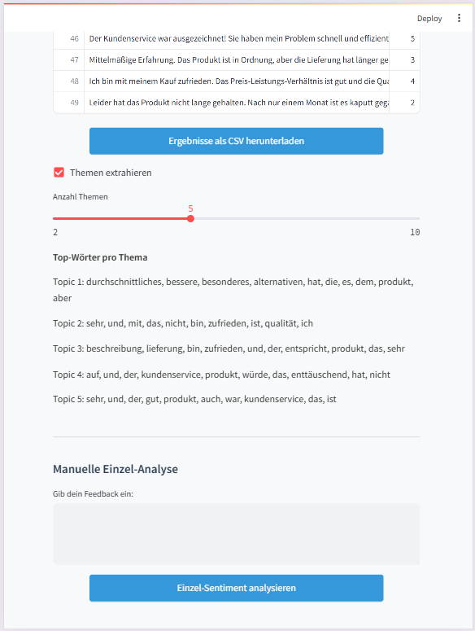
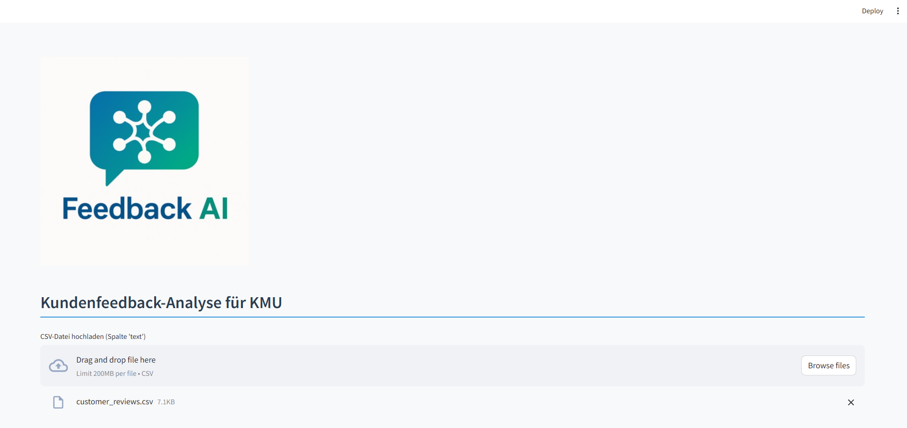

# Responsive Tests für Feedback-AI

In diesem Dokument siehst du, wie die App auf verschiedenen Viewport-Breiten dargestellt wird.

---

## 1. Mobile (360 px Breite)

- **Überschrift**: Schriftgröße 1.5 rem, Farbe #2c3e50, Unterstrich in #3498db  
- **Buttons**: 100 % Breite, Mindesthöhe 44 px, Hintergrund #3498db, Text weiß  
- **Text-Area**: 100 % Breite, Padding 0.75 rem, Rand 1 px #ecf0f1  
- **Tabellen** (falls sichtbar): Header dunkelblau, Zeilen abwechselnd hellgrau/weiß  

---

## 2. Tablet (768 px Breite)

- **Überschrift**: Schriftgröße 1.75 rem, Farbe #2c3e50  
- **Buttons**: 80 % Breite, zentriert (10 % Rand links/rechts), Mindesthöhe 44 px  
- **Text-Area**: 90 % Breite, Padding 0.5 rem  
- **Tabellen**: wie Desktop, aber ggf. mit Scrollbar bei breiten Inhalten  

---

## 3. Desktop (1200 px Breite)

- **Überschrift**: Schriftgröße 2 rem, Farbe #2c3e50  
- **Buttons**: automatische Breite (inhaltsbasiert), Mindesthöhe 36 px  
- **Text-Area**: 60 % Breite, Padding 0.5 rem  
- **Tabellen**: 100 % Breite, Header dunkelblau (#2c3e50), Zeilen abwechselnd #ffffff/#ecf0f1  

---

## 4. Browser-Kompatibilität (Testmatrix)

| Browser   | Version           | Gerät    | Problemfrei? | Anmerkungen                                   |
|-----------|-------------------|----------|--------------|-----------------------------------------------|
| Chrome    | 137.0.7151.69     | Desktop  | Ja           | –                                             |
| Chrome    | 137.0.7151.69     | Tablet   | Ja           | Alles korrekt skaliert                        |
| Chrome    | 137.0.7151.69     | Mobile   | Ja           | Menü klappt, Buttons lesbar                   |
| Firefox   | 139.0.1           | Desktop  | Ja           | –                                             |
| Firefox   | 139.0.1           | Tablet   | Ja           | Leichte Verschiebung bei Scrollbar            |
| Firefox   | 139.0.1           | Mobile   | Ja           | Alles gut angepasst                           |
| Edge      | 137.0.3296.62     | Desktop  | Ja           | –                                             |
| Edge      | 137.0.3296.62     | Tablet   | Nein         | Darstellung zu kompakt, Buttons kaum klickbar |
| Edge      | 137.0.3296.62     | Mobile   | Nein         | Inhalte extrem klein, Navigation schwierig    |
