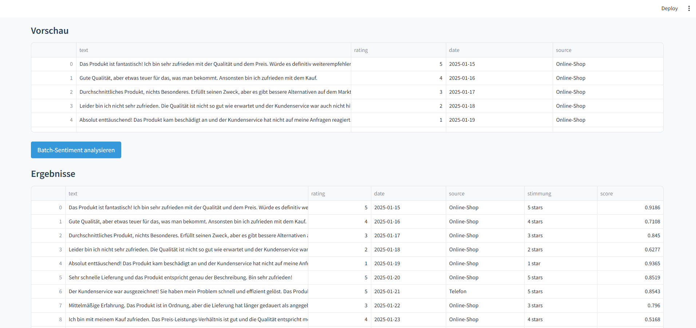

# Responsive Tests für Feedback-AI

In diesem Dokument siehst du, wie die App auf verschiedenen Viewport-Breiten dargestellt wird.

---
## 1. Mobile (360 px Breite)

- **Überschrift**: Schriftgröße 1.5 rem, Farbe #2c3e50, Unterstrich in #3498db  
- **Buttons**: 100 % Breite, Mindesthöhe 44 px, Hintergrund #3498db, Text weiß  
- **Text-Area**: 100 % Breite, Padding 0.75 rem, Rand 1 px #ecf0f1  
- **Tabellen** (falls sichtbar): Header dunkelblau, Zeilen abwechselnd hellgrau/weiß  

---
## 2. Tablet (768 px Breite)

- **Überschrift**: Schriftgröße 1.75 rem, Farbe #2c3e50  
- **Buttons**: 80 % Breite, zentriert (10 % Rand links/rechts), Mindesthöhe 44 px  
- **Text-Area**: 90 % Breite, Padding 0.5 rem  
- **Tabellen**: wie Desktop, aber ggf. mit Scrollbar bei breiten Inhalten  

---
## 3. Desktop (1200 px Breite)

- **Überschrift**: Schriftgröße 2 rem, Farbe #2c3e50  
- **Buttons**: automatische Breite (inhaltsbasiert), Mindesthöhe 36 px  
- **Text-Area**: 60 % Breite, Padding 0.5 rem  
- **Tabellen**: 100 % Breite, Header dunkelblau (#2c3e50), Zeilen abwechselnd #ffffff/#ecf0f1  

